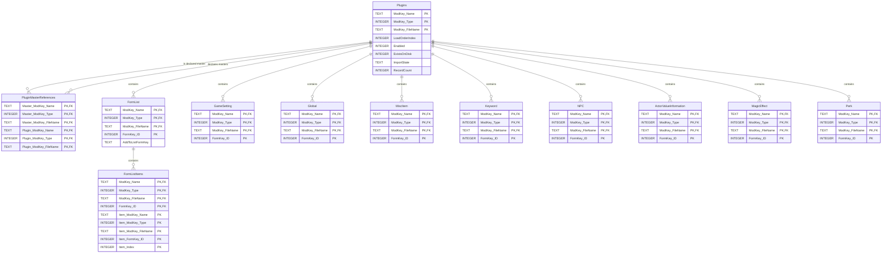

# SQLite Entity Relationship Diagram

## Diagram

This diagram includes relationships declared as SQLite foreign keys. Composite keys are shown by marking each
participating column as `PK` or `FK`.

## Important Indexes

The schema has no separately declared unique indexes. Composite primary keys provide row uniqueness.

- `Plugins`: indexes on `LoadOrderIndex`, `ImportState`, and the source fingerprint columns.
- `PluginMasterReferences`: indexes on the declared-master key and declaring-plugin key.
- `FormListItems`: indexes on referenced item ID plus owning form-list key, and on `Item_Index`.
- Each typed record table: a non-unique index on `FormKey_ID` for cross-plugin comparison lookup.

## Important Constraints

- Every declared foreign key uses `ON DELETE CASCADE`.
- `Plugins.Enabled` and `Plugins.ExistsOnDisk` must be `0` or `1`.
- `Plugins.ImportState` must be `Current`, `Changed`, `Missing`, `Failed`, or `Unsupported`.
- `Plugins.RecordCount`, every typed-record `FormKey_ID`, and `FormListItems.Item_FormKey_ID` must be non-negative.
- `GameSetting.IsCompressed` and `GameSetting.IsDeleted` must be `0` or `1`.

## Inferred Relationships

These columns contain record-reference data but are not declared SQLite foreign keys. They are intentionally omitted
from the Mermaid relationship lines:

- `FormList.AddToListFormKey`
- `FormListItems.Item_ModKey_Name`, `Item_ModKey_Type`, `Item_ModKey_FileName`, and `Item_FormKey_ID`
- `Keyword.AttractionRuleFormKey`
- `NPC.VoiceFormKey`, `RaceFormKey`, `CombatOverridePackageListFormKey`, `CombatStyleFormKey`,
  `DefaultPackageListFormKey`, and `CrimeFactionFormKey`
- `MagicEffect.ActorValue2FormKey`, `ResistValueFormKey`, `PerkToApplyFormKey`, `EquipAbilityFormKey`,
  `ExplosionFormKey`, `CastingArtFormKey`, `HitEffectArtFormKey`, `HitShaderFormKey`, `ImageSpaceModifierFormKey`,
  `ImpactDataFormKey`, and `ProjectileFormKey`
