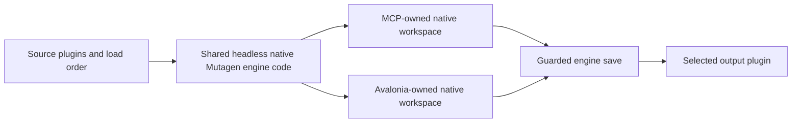
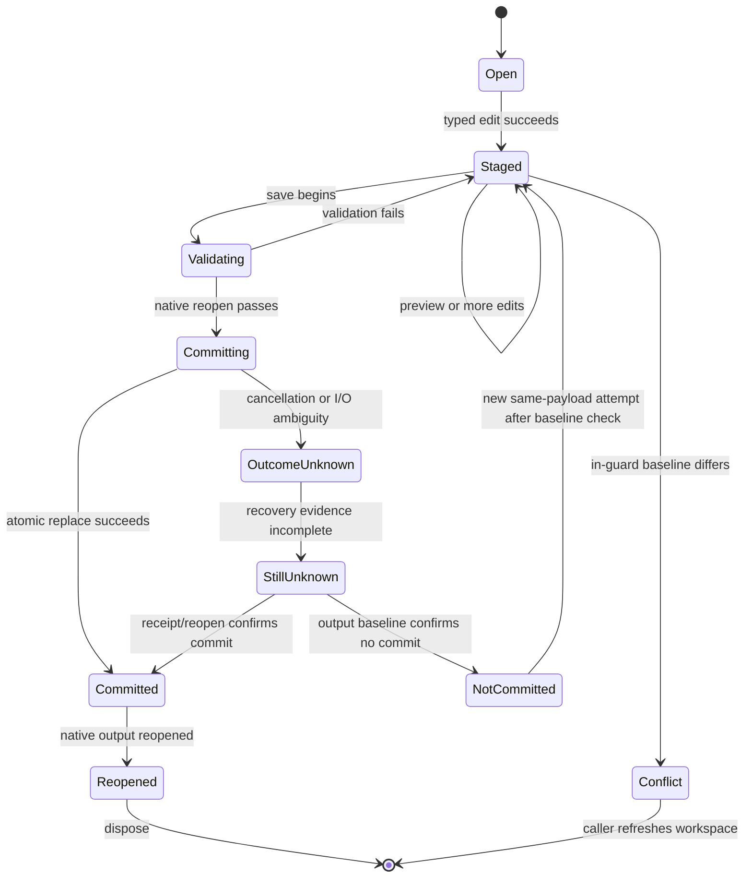

# FormList MVP Contracts

Status: Proposed for review before the engine rebuild.

This document defines the first authoring slice for FormLists (`FLST`) in Starfield, Fallout 4, and Skyrim Special Edition. It is an engine contract, not a statement that the authoring engine, MCP, or Avalonia workflow is implemented. The accepted architectural direction is a fully Mutagen-backed headless native engine with thin independent consumers.

## Boundary and ownership

The shared engine owns native Mutagen load, record inspection, staged mutation, preview, save coordination, reopen verification, and result reporting. An MCP host and the Avalonia application each own an independent live workspace and call the same engine contracts. A workspace is not synchronized live with another workspace and the first slice does not provide remote or multi-user hosting.

Native Mutagen getters, mutable records, and native mod groups are the authority for record identity, fields, references, ordering, and serialization. Operational envelopes may report identifiers, revisions, counts, warnings, and errors, but they must not become a record model, shadow DTO store, cache, or index. The engine must not quietly introduce Mutagen `LinkCache` or a custom equivalent.

The current application remains a SQLite-backed importer and comparison tool. Its `CreationsForge.Core` DTOs, importers, repositories, `CreationsForge.Migrations`, and existing validation harness are legacy consumers during migration; see [LEGACY-BACKEND-MIGRATION.md](LEGACY-BACKEND-MIGRATION.md).

## Version and source evidence

The first implementation targets `Mutagen.Bethesda` package version `0.54.0-alpha.276` on `net10.0`, as restored by the current repository. The package source and generated field index are the source for API availability; a planned operation must fail clearly when the installed native API cannot perform it. A package version alone does not prove binary compatibility or complete ESM serialization coverage.

The current source readers demonstrate `FormLists` enumeration and mapping into `FormListDTO` in `CreationsForge.Starfield/StarfieldRecordReaderService.cs`, `CreationsForge.Fallout4/Fallout4RecordReaderService.cs`, and `CreationsForge.Skyrim/SkyrimRecordReaderService.cs`. Those readers are read/import paths, not evidence that authoring or every serialized field is complete.

The current installed Spriggit CLI reports `0.40.1+Branch.main.Sha.da8152cdfd0313fbf08b217acffc6ac0b6b1b5b5`, while its embedded baseline references an older Mutagen package than this repository. No compatible local translation package was established, so native field names must not be treated as proven Spriggit YAML property names. Versioned translator packages and the `.spriggit` package metadata are future prerequisites for serialized parity checks.

## Native field contract

Every game exposes the generated common record header fields in the `FormList_FieldIndex` shape: `MajorRecordFlagsRaw`, `FormKey`, `VersionControl`, `EditorID`, `FormVersion`, `Version2`, and the applicable game-specific `MajorRecordFlags`. Mutable inherited flags such as `IsCompressed` and `IsDeleted`, and convenience values such as `TitleString`, are native conveniences and must not be confused with serialized fields.

| Game | Native FormList fields in the first contract | Shape and preservation rule |
| --- | --- | --- |
| Starfield | `Components`, `Name`, `Items`, `ConditionalEntries`, `AddToList` | `Components` is a heterogeneous typed native component list; `Name` is `TranslatedString`; `Items` is `ExtendedList<IFormLinkGetter<IStarfieldMajorRecordGetter>>`; `ConditionalEntries` contains an `Index` and typed `Conditions`; `AddToList` is one optional scalar `IFormLinkNullable<IFormListGetter>`. |
| Fallout 4 | `Name`, `Items` | `Name` is `TranslatedString`; `Items` is `ExtendedList<IFormLinkGetter<IFallout4MajorRecordGetter>>`. |
| Skyrim Special Edition | `Items` | `Items` is `ExtendedList<IFormLinkGetter<ISkyrimMajorRecordGetter>>`; the exact alpha exposes no native `Name` property, so the first contract must not invent one. |

Common header handling is explicit:

| Header field | Read and preserve | Staged edit or writer ownership |
| --- | --- | --- |
| `FormKey` | Read as the native identity. | Immutable for an existing record; allocate through the native output mod API for a new record. |
| `EditorID`, `FormVersion`, `VersionControl`, `Version2` | Read and preserve the native value, including absence where nullable. | Edit only through a verified native mutable API; otherwise treat as writer-owned and report normalization. |
| `MajorRecordFlagsRaw` and game-specific major flags | Read and preserve native flags. | Edit only through verified native flag APIs; arbitrary raw integer writes are outside the contract. |

Fields without a verified mutable setter are writer-owned, and any writer normalization is reported separately from semantic edits.

`ExtendedList` derives from `List` and therefore preserves insertion order and permits duplicates. A null or absent native value remains absent. An empty collection remains empty. The engine must preserve unknown and untouched native data through native Mutagen mutation and serialization; it must not flatten a component, condition, or link into a generic string or binary bucket.

If native Mutagen cannot preserve an input's untouched or unknown data for the selected game/output writer, the operation must fail closed before commit and identify the preservation gap. Expected native writer header changes are reported separately from semantic record-data changes; the engine must not claim byte identity when the writer legitimately updates headers or serialization metadata.

Starfield component entries retain their concrete native discriminator and full nested payload. For example, `KeywordFormComponent`, `FullNameComponent`, `ModelComponent`, and `FormLinkDataComponent` are different typed components. Starfield conditional entries retain the entry index and every native condition. A condition includes `CompareOperator`, `Flags`, `Unknown1`, `Unknown2`, and typed `Data`; condition data includes `Function`, `RunOnType`, `Reference`, `Unknown3`, `UseAliases`, and `UsePackageData`, plus the full concrete typed condition-data payload exposed by Mutagen. The engine must not reduce these values to a generic condition blob.

The existing Core DTO currently maps `Name`, `AddToList`, and `Items` for the Starfield reader and maps only the corresponding existing DTO surface for Fallout 4 and Skyrim. Omitted `Components` and `ConditionalEntries`, and the Skyrim native-name difference, are explicit implementation and acceptance work for this contract.

## Identity, load order, and source/output roles

Every operation is scoped by an explicit workspace identifier, game, source plugin, and output plugin. A `FormKey` identifies the origin record by its native `ModKey` and numeric ID. A `ModKey` includes the plugin name, type, and file name; comparison and save guards use the canonical native identity and case rules supplied by Mutagen and the repository.

The source role is read-only for the workspace. The source may be an ESM or another selected load-order plugin and is loaded using the game-specific native Mutagen construction path. The output role is a separate caller-selected plugin that receives new or overridden FormLists. The engine must reject an output path that resolves to the source path for the same operation.

The load-order input is ordered and explicit. Native master resolution and FormKey translation use the supplied load order and native game adapter behavior. Reference lookup may target FormLists or any other supported major-record family exposed by the game-specific native getter; the lookup returns native identity and typed availability information. The engine must not claim that every cross-family reference can be resolved without a native group/getter or that every ESM can be serialized for every game.

ESM output is supported only where the selected Mutagen game release and native writer accept the caller's output plugin configuration. The caller must choose the output file name and native flags/type; the engine validates the native combination before mutation and reports an unsupported-output error when it cannot be represented. This contract does not promise universal cross-game ESM binary compatibility.

## Operations and result envelopes

The following operations are the minimum shared engine surface. Names are contract names and may be adapted to C# or MCP naming conventions without changing their semantics.

| Operation | Required input | Result and side effects |
| --- | --- | --- |
| `OpenSource` | Workspace ID, game, source path, ordered load order, source baseline request | Opens native getters, records the source baseline, and returns a workspace revision plus source identity. It does not mutate or write the source. |
| `SelectOutput` | Workspace ID, output path, native output type/flags | Validates a separate writable output role and records an output baseline. It does not create or modify output until a save. |
| `ListPlugins` | Workspace ID and source/load-order scope | Enumerates the supplied native load-order plugins in order and returns minimal native identities and roles. It does not build a persistent plugin index. |
| `ListFormLists` | Workspace ID and optional source/output scope | Enumerates native FormList groups in native order and returns minimal identity summaries. It must not materialize a parallel record cache. |
| `ReadFormList` | Workspace ID, `FormKey`, source or staged scope | Returns a read view of native fields and typed nested data needed by the caller. The view is ephemeral and is not an authority separate from the native record. |
| `ResolveReference` | Workspace ID, native `FormKey` link, target family or native link type | Resolves through the supplied native load order/groups and returns a typed native result or an explicit unresolved/unsupported status. |
| `CompareFormList` | Workspace ID, `FormKey`, source/output or two staged scopes | Compares native typed fields and collection positions and reports semantic changes, expected writer-owned changes, unresolved links, and preservation warnings without writing. |
| `BeginEdit` | Workspace ID, target `FormKey` or new-record request | Creates a staged edit against the current native mutable record or allocates a new native record in the output workspace. It records the base workspace revision. |
| `ApplyFormListEdit` | Edit ID and typed field operation | Mutates native records in the workspace staging scope, preserving native list order, duplicates, nulls, and untouched fields. It advances the workspace revision only after the native operation succeeds. |
| `Preview` | Workspace ID or edit ID | Reopens or inspects a disposable native staged representation and reports the proposed FormList diff, references, and validation warnings without committing output. |
| `Save` | Workspace ID, expected revision, output baseline, cancellation token | Performs the guarded save protocol below, validates and reopens output, and returns a committed or explicitly failed post-save result. |
| `RecoverSave` | Workspace ID, predispatch operation ID, attempted output association | Performs read-only receipt-independent recovery and returns `Committed`, `NotCommitted`, or `StillUnknown` without staging or writing. |
| `Reopen` | Workspace ID and committed output receipt | Releases the old native handles, reopens the committed output using the same native load-order rules, and reports the observed record identity and revision. |
| `Dispose` | Workspace ID | Releases native mods, streams, temporary files, and lock handles. Repeated disposal is idempotent; a disposed workspace rejects further operations. |

Every `Save` has a caller-supplied predispatch operation ID. The engine records a save intent before staging or commit and associates it with the workspace ID, canonical attempted output path, sibling staging path when used, output baseline, expected workspace revision, target FormKey/edit identity, and canonical operation payload. This is operational recovery metadata and is not a record model.

`RecoverSave` is a read-only recovery operation that accepts the workspace ID, predispatch operation ID, and attempted output association. It consults the operation receipt/journal and reopens the attempted output through native Mutagen as needed; it does not stage, replace, or otherwise write. It returns exactly one recovery state: `Committed` when the intended replacement is confirmed, `NotCommitted` when the original output still matches its baseline and no replacement occurred, or `StillUnknown` when the evidence cannot prove either state.

Result envelopes contain only operation status, workspace/edit/operation IDs, source/output identity, base and resulting revisions, counts, warnings, and typed error details. They may include an ephemeral native record view for a read operation. They must not persist a second representation of a record or expose an arbitrary property setter as a substitute for domain operations.

## Editing, allocation, and overrides

FormList-only authoring means the first acceptance slice creates and edits `FLST` records and their native FormList fields. It does not authorize authoring for other record families. FormList item links may point at other native major-record families because `Items` is typed as a game-wide major-record link list; resolving or validating those links must use native getters/groups and must not add other-family authoring.

New-record allocation uses the native Mutagen output mod/group allocation API for the selected game and output plugin. The engine must return the allocated native `FormKey` and retain it as the edit identity. It must reject collisions and invalid master/load-order combinations before save. The contract does not define a custom allocator, a global ID index, or a compaction policy.

An override edits an existing origin `FormKey` in the selected output plugin through the native override API. The source record remains unchanged. The engine must retain all native fields not explicitly edited and must preserve load-order semantics. A caller may choose a new record or an override; the engine must report which role was used.

Supported staged field operations are typed and explicit: set or clear the Starfield and Fallout 4 `Name`; set or clear Starfield `AddToList`; replace, insert, remove, or clear ordered `Items`; set or clear Starfield `ConditionalEntries` while retaining typed indexes and conditions; and update, add, or remove typed Starfield `Components` through operations defined for each native component type. A mutation that cannot preserve an unknown or untouched native payload must fail before save rather than silently discard it.

Preview reads the staged native record and compares it with the base record by native field and collection position. It reports added, removed, changed, duplicated, null, unresolved, and untouched values. Preview does not write the source or output and does not imply that serialization will succeed.

## Workspace revisions, retries, and idempotence

Each workspace starts at a deterministic revision based on the source and output baselines and advances monotonically after successful staged operations. Every mutating request carries an operation ID and expected workspace revision. A repeated operation ID returns the recorded operation result when the original outcome is known; it does not apply the edit twice. An operation with a stale expected revision fails with a conflict result and leaves the workspace unchanged.

Retries are safe for read, preview, and disposal operations. Every mutating operation records its canonical operation payload and outcome. Reusing an operation ID with the same payload replays the recorded result; reusing it with a different payload fails with `OperationIdReuse` and does not mutate state. A rejected validation operation is replayed as rejected; a corrected retry uses a new operation ID and the current expected revision. A lost `Save` response is recovered with `RecoverSave` using the workspace ID, predispatch operation ID, and attempted output association. `Committed` forbids a second write and directs the caller to reopen/compare; `NotCommitted` permits one new save attempt with the same payload only after the current baselines are rechecked; `StillUnknown` forbids an automatic retry until an operator or later recovery proves the outcome.

Independent MCP and Avalonia workspaces have independent revisions and native handles. A second workspace can make the source or output baseline stale; the first workspace to acquire the save guard and pass the in-guard comparison wins. A cooperating writer uses the same guard protocol. A non-cooperating writer can still change a file after a comparison or outside the guard, so the engine reports that limitation and cannot promise protection against every external process.

## Save guard and commit boundary

The engine captures baselines for the source, output, ordered load-order inputs, and every master or other file used for reference resolution when a workspace opens them. A baseline includes canonical path/role/identity and content metadata sufficient to detect a change; a fingerprint alone is not a TOCTOU defense. Before commit, the engine acquires an exclusive, canonical-path-scoped guard for cooperating writers, compares every current source/output/load-order input used by the staged result inside the guard against its captured baseline, and refuses a stale or conflicting save.

The staged sibling file is written beside the output when the platform permits it. The engine validates the staged file by reopening it through the native Mutagen reader and checking the requested FormList identity and typed field result. It then commits by an atomic replace or rename supported by the platform. The first MVP supports only a verified atomic commit guarantee; if the platform cannot provide it, the engine returns `UnsupportedCommitGuarantee` before commit.

Cancellation is checked during load, discovery, mutation, staging, validation, and before the commit boundary. Cancellation before the boundary discards staging and leaves source/output unchanged. Once commit begins, cancellation cannot promise rollback; the engine completes or reports `CommitOutcomeUnknown` and requires reopen inspection. A successful replace followed by a reopen or post-commit validation failure returns `CommittedButReopenFailed` and never claims that the output was uncommitted. A failed validation or replace before a known commit returns `NotCommitted` and retains the original output under the verified atomic protocol.

The commit boundary is the transition into `Committing`. Before that transition the engine can discard staged files and native mutable state. After it, the result must distinguish `Committed`, `NotCommitted`, and `StillUnknown`; a known replacement followed by reopen failure is `CommittedButReopenFailed` and is never relabeled as uncommitted. Cancellation is not reported as a clean rollback.

## Errors and disposal

Errors are stable categories with a human-readable detail and an operation/workspace identity: `InvalidWorkspace`, `SourceUnavailable`, `OutputInvalid`, `UnsupportedGameField`, `UnsupportedOutputType`, `UnsupportedCommitGuarantee`, `RecordNotFound`, `ReferenceUnresolved`, `RevisionConflict`, `StaleBaseline`, `OperationIdReuse`, `ValidationFailed`, `SerializationFailed`, `CommitFailed`, `NotCommitted`, `CommittedButReopenFailed`, `CommitOutcomeUnknown`, `Canceled`, and `Disposed`. Native exception details may be attached for diagnostics without exposing full binary payloads.

A failed staged edit leaves the prior staged revision intact. A source or output open failure leaves no usable workspace. A save failure before commit leaves the existing output untouched where the platform supports the stated atomic protocol. Native mods, streams, temporary files, and exclusive guards are disposed in all paths. No operation may close a handle owned by another independent workspace.

## Acceptance matrix

The first implementation is accepted only when the following evidence exists for Starfield, Fallout 4, and Skyrim Special Edition:

| Evidence | Required outcome |
| --- | --- |
| Native field round trips | Each supported native field is read, staged, saved, reopened, and compared through native getters; unsupported fields are reported explicitly. |
| Source preservation | Source file bytes and source native record remain unchanged after preview, staged edit, save, cancellation before commit, and save failure. |
| Output preservation | Output records, fields, ordering, duplicates, nulls, unknown values, and unrelated plugin data survive a targeted FormList edit. |
| New record and override | A native new-record allocation and an existing-record override produce valid, distinct identities with correct load-order behavior. |
| Cross-family references | FormList item links resolve or report an explicit native unresolved result across the supported major-record families without authoring those families. |
| Independent workspaces | Stale source/output baselines and conflicting independent saves produce deterministic revision/conflict results; no silent last-writer overwrite is accepted. |
| Cancellation and save failure | Cancellation before commit leaves no output change; cancellation at or after commit is reported with post-commit outcome; injected or observed save failures retain recoverable state. |
| Reopen and disposal | A committed output reopens through native Mutagen and all handles/temp files/guards are released, including repeated disposal. |

Recovery acceptance must include a negative response-loss test: deliberately discard the `Save` response after a known commit, call `RecoverSave` with the predispatch operation ID and attempted output association, require `Committed`, then verify that retrying the original request replays the receipt without a second replacement. A separate precommit failure must recover as `NotCommitted` before a same-payload retry is allowed; any inability to prove either outcome remains `StillUnknown` and blocks automatic retry.

Spriggit YAML property spelling, default omission, and sample parity are not verified in the current environment because all three extraction variables are unset and no repository-root `.env` is present. The installed Spriggit CLI has no locally established translator compatible with the repository's Mutagen version. The implementation must complete a game-specific field matrix against an explicitly pinned compatible translator and extraction samples before claiming serialized coverage. No universal binary serialization guarantee is implied by this contract.

## Explicit exclusions

The first slice excludes authoring for other record families, live workspace synchronization, remote or multi-user MCP hosting, plugin merge/split/compaction/general conversion, new asset-preview features, and broad UI redesign. It also excludes deletion of the legacy SQLite backend; that removal follows the staged migration in [LEGACY-BACKEND-MIGRATION.md](LEGACY-BACKEND-MIGRATION.md) after replacement acceptance.

## Related files

- `CreationsForge.Starfield/StarfieldRecordReaderService.cs`
- `CreationsForge.Fallout4/Fallout4RecordReaderService.cs`
- `CreationsForge.Skyrim/SkyrimRecordReaderService.cs`
- `CreationsForge.Core/DTOs/Records/FormListDTO.cs`
- `CreationsForge.Core/DTOs/Records/FormListItemDTO.cs`
- [Architecture](../ARCHITECTURE.md)
- [Domain model](../DOMAIN-MODEL.md)
- [Workflow validation handoff](../Instructions/WorkflowValidation.md)
