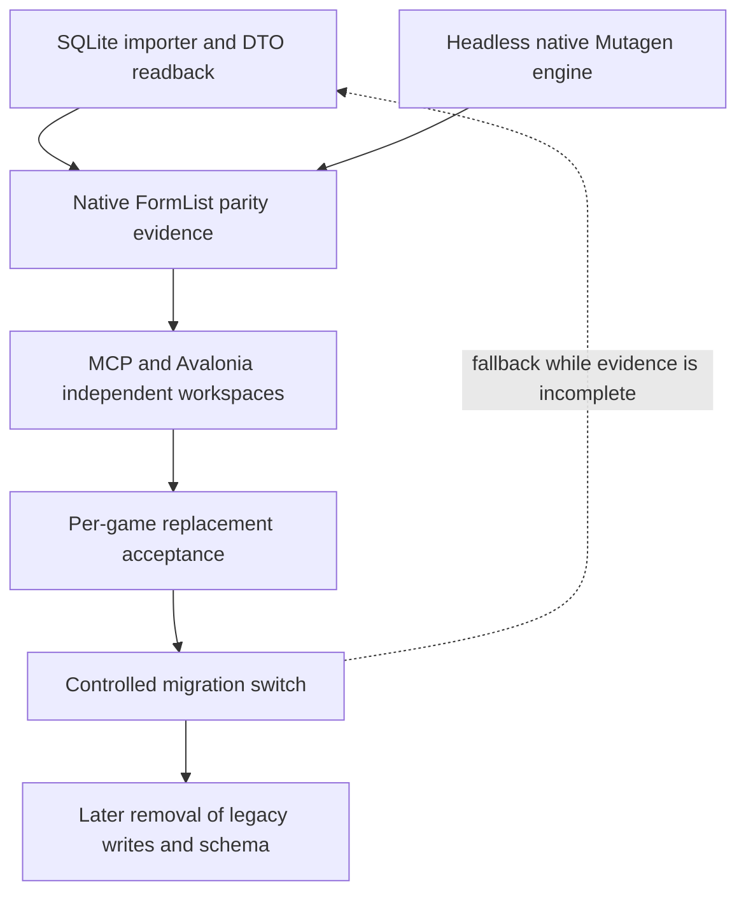

# Legacy Backend Migration

Status: Proposed migration boundary for the Mutagen FormList authoring engine.

This document inventories the current SQLite/import backend and defines the replacement sequence. It does not delete projects, change nested instructions, migrate data, or claim that the replacement engine exists. The current backend remains the behavior and test reference until the native engine has replacement acceptance evidence.

## Current legacy inventory

| Area | Current projects and paths | Current responsibility |
| --- | --- | --- |
| Core contracts and persistence | `CreationsForge.Core/DTOs/Records/FormListDTO.cs`, `FormListItemDTO.cs`, `Models/Database/FormList.cs`, `Repositories/FormListRepository.cs`, `Repositories/FormListItemRepository.cs` | DTOs, NPoco models, parameterized SQLite queries, record-tree/comparison readback, and FormList child persistence. |
| Import orchestration | `CreationsForge.Core/Importers/FormListImporter.cs`, `Importers/GameImporter.cs`, `Services/RecordImportService.cs`, `Services/GameImportWorkflowService.cs`, `Services/AllGamesImportWorkflowService.cs` | Reads mapped DTOs, writes parent/child rows, replaces stale rows by plugin, reports progress, and handles cancellation around import phases. |
| Shared child persistence | `CreationsForge.Core/Services/RecordChildImportService.cs`, `RecordLocalizedStringImportService.cs`, `KeywordMappingImportService.cs`, `ModelImportService.cs`, `SoundMappingImportService.cs`, `RecordComponentImportService.cs`, `ConditionRuleImportService.cs`, `ScriptingAdapterImportService.cs`, `ReflectionImportService.cs`, and `RawRecordPayloadImportService.cs` | Dispatches current DTO capability interfaces to SQLite child repositories linked to `RecordInstances`; these services are legacy persistence paths and are not native authoring state. |
| Database and migrations | `CreationsForge.Core/Database/DatabaseResetService.cs`, `DatabaseSchemaInitializer.cs`, `Database/SqliteConnectionFactory.cs`; `CreationsForge.Migrations/DatabaseMigrationRunner.cs`, embedded migration scripts | Opens/resets `CreationsForge.sqlite`, applies DbUp migrations, and treats `SchemaVersions` as migration state. |
| Game adapters | `CreationsForge.Starfield/StarfieldRecordReaderService.cs`, `CreationsForge.Fallout4/Fallout4RecordReaderService.cs`, `CreationsForge.Skyrim/SkyrimRecordReaderService.cs` and their `*RecordReader.cs`, modules, and plugin readers | Loads game-specific Mutagen mods and maps supported records into Core DTOs. Current FormList mapping covers the existing DTO surface only. |
| Composition | `CreationsForge.Bootstrap/Composition/AutofacConfigurator.cs`, `CreationsForge.Core/CoreModule.cs`, and game `*Module.cs` files | Registers SQLite, repositories, importers, readers, and game-specific services for UI and console consumers. |
| Console workflow | `CreationsForge.Console/Program.cs`, `CommandLine/GameArgumentParser.cs` | Runs import and reset workflows, including `--reset-all`; it is the existing manual import harness. |
| Avalonia consumers | `CreationsForge/` application, view models, and views; `CreationsForge.PresentationTests/` | Shows imported SQLite DTOs, comparison rows, and import progress. It does not call Mutagen directly. |
| Validation | `CreationsForge.DataValidationTests/` and `CreationsForge.Specification/Validation/` | Loads Spriggit YAML and compares selected samples against DTOs read from the imported SQLite database. It requires extraction roots and a fresh compatible database. |
| Tests | `CreationsForge.UnitTests/` and `CreationsForge.PresentationTests/` | Covers Core services/import workflows and Avalonia/headless behavior; it does not prove live native authoring or game runtime behavior. |
| Asset boundary | `CreationsForge.Bethesda.Assets/` and `CreationsForge.Bethesda.Assets/AGENTS.md` | Owns archive and preview readers. Existing asset indexes do not authorize changes to preview or authoring behavior. |

The current SQLite shape is intentionally an import/readback backend: `FormLists` stores parent fields, `FormListItems` stores indexed links, and shared `RecordInstances`/`LocalizedStrings` paths support tree and localized comparison behavior. It is not an authority for a future native record model.

## Nested instruction paths that govern the migration

The replacement implementation must explicitly reconcile these current rules before editing governed code:

- `AGENTS.md` defines Core DTO/schema boundaries, no custom record buckets, Mutagen game separation, SQLite safeguards, test freshness, and documentation requirements.
- `Documentation/AGENTS.md` requires durable docs to describe approved behavior and prohibits incidental changes to naming, changelog, known-issues, database, and agent files.
- `CreationsForge.Core/AGENTS.md` requires DTOs and repositories to remain UI-neutral, NPoco/parameterized SQL for the existing backend, and first-class typed record modeling.
- `CreationsForge.Migrations/AGENTS.md` makes DbUp `SchemaVersions` authoritative and prohibits generic payload schema for known fields.
- `CreationsForge.Bootstrap/AGENTS.md` assigns registration and lifetime wiring to composition roots.
- `CreationsForge.Starfield/AGENTS.md`, `CreationsForge.Fallout4/AGENTS.md`, and `CreationsForge.Skyrim/AGENTS.md` require game-specific Mutagen mapping, field classification, and cross-game support decisions.
- `CreationsForge.DataValidationTests/AGENTS.md` assumes imported SQLite DTOs, fresh database state when mapping changes, and explicit Spriggit extraction prerequisites.
- `CreationsForge/AGENTS.md` keeps Mutagen, SQL, import orchestration, and migration logic out of the Avalonia presentation layer.
- `CreationsForge.PresentationTests/AGENTS.md` governs headless UI tests and extraction-dependent skips.
- `CreationsForge.Console/AGENTS.md` governs the existing import/reset harness and stable CLI behavior.
- `CreationsForge.Bethesda.Assets/AGENTS.md` keeps archive/preview ownership separate; existing indexes are not authorization for new preview features.

These files are current constraints for the legacy paths. This document proposes replacement wording for later approved instruction updates; it does not edit them.

## Proposed instruction replacements

The following are concrete later edits to the named headings or clauses. They require a separate approved instruction-file change after the native engine shape is accepted.

| Instruction file and current section | Proposed replacement wording or boundary |
| --- | --- |
| `AGENT-REPO-CONTEXT.md`, `C# implementation conventions` and `Existing SQLite import and persistence safeguards` | State that SQLite/NPoco rules govern the existing importer only; the native engine uses typed Mutagen getters, mutable records, groups, and serialization and must not introduce custom record models, caches, indexes, LinkCache shadow state, or generic payload storage. Require the FormList contract and native preservation matrix before removing importer paths. |
| `CreationsForge.Core/AGENTS.md`, `Services, stores, and repositories` and `First-class record modeling` | Keep NPoco and parameterized SQL requirements for legacy Core services, and add that native authoring state is owned by the headless engine rather than Core DTOs/repositories. Operational envelopes cannot become persisted record models. |
| `CreationsForge.Starfield/AGENTS.md`, `CreationsForge.Fallout4/AGENTS.md`, and `CreationsForge.Skyrim/AGENTS.md`, `Mutagen and Spriggit` | Replace reader-only mapping language for the authoring slice with game-adapter ownership of native load-order construction and exact FormList fields. Require fail-closed preservation where the selected writer cannot retain untouched data, and require version-matched serialization evidence before declaring a field complete. |
| `CreationsForge.DataValidationTests/AGENTS.md`, `Imported validation database freshness` and `Completion rule for validation work` | Mark imported SQLite DTO validation as the legacy path. Add the native FormList round-trip/reopen matrix and state that extraction-root absence or translator mismatch leaves serialized parity unverified; retain the SQLite suite until equivalent native evidence passes. |
| `CreationsForge.Bootstrap/AGENTS.md`, `Autofac` and `Validation` | Require one shared headless engine registration with explicit workspace/native-handle lifetimes, while MCP and Avalonia adapters remain consumer registrations. Startup smoke checks must not be treated as save or target-game acceptance. |
| `CreationsForge/AGENTS.md`, `Boundaries` and `Avalonia and MVVM` | State that Avalonia calls the native engine through UI-neutral contracts and owns only its workspace presentation state; it must not duplicate native records or implement save guards. |
| `CreationsForge.Console/AGENTS.md`, `Imports and extraction` | Retain the CLI as a legacy import/validation harness until migration acceptance; native authoring commands must use the shared engine and explicit source/output roles and must never reset the configured SQLite database implicitly. |
| `CreationsForge.Bethesda.Assets/AGENTS.md`, `Database and lookup behavior` | Clarify that existing asset indexes support preview lookup only and are not authorization for FormList reference indexes, authoring caches, or new preview features. |

These proposed clauses preserve each directory's existing responsibility while naming the new native authority. They should be applied only after implementation paths and tests are identified; until then, the current instruction files remain authoritative for their existing code.

## Replacement boundary wording

The following wording is the proposed boundary for the future engine implementation plan:

> The native authoring engine is a headless, UI-neutral Mutagen service. Native Mutagen getters, mutable records, groups, load-order construction, and native serialization are the authority. Do not create custom record models, record caches, LinkCache-based shadow state, indexes, raw JSON payloads, or generic property setters to represent FormLists. Operational result envelopes may carry identity, revision, status, counts, warnings, and errors only.

> The first authoring slice is FormList-only for Starfield, Fallout 4, and Skyrim Special Edition. Game-specific Mutagen APIs and field differences remain in game adapters. MCP and Avalonia are independent consumers with independent live workspaces; they do not synchronize native mutable state.

> The engine must preserve native ordering, duplicates, nulls, unknown values, and untouched output data. Reference lookup uses native load-order groups/getters. Other record families may be resolved as typed links when native APIs expose them, but are not authorable in this slice.

> A save captures source/output and all load-order/reference-input baselines, serializes cooperating writers with an exclusive canonical-path guard, compares baselines inside that guard, stages a sibling output, reopens and validates it through native Mutagen, and commits only through a verified platform-supported atomic replace. Fingerprints alone do not prevent TOCTOU. A non-cooperating writer can evade the guard and must be reported as a limitation; an unsupported atomic guarantee returns before commit.

> Cancellation before commit discards staging. Cancellation at or after commit reports the post-commit outcome or an indeterminate outcome requiring reopen inspection. Save errors must distinguish pre-commit failure, failed commit, and unknown commit outcome. Disposal releases native handles, temporary files, and guards without affecting another workspace.

This wording is deliberately narrower than a general plugin conversion API. It preserves the existing application boundary while making native Mutagen behavior the future source of truth.

## Removal sequence

Removal is a later implementation sequence and requires behavior-preserving evidence at each boundary:

1. Implement and test the shared native engine against [FORMLIST-MVP-CONTRACTS.md](FORMLIST-MVP-CONTRACTS.md) for all three games, including native field round trips, source/output preservation, stale independent workspaces, cancellation, save failure, and reopen.
2. Add independent MCP and Avalonia workspace adapters that consume engine operations and result envelopes without duplicating native records or introducing synchronization.
3. Run the legacy importer and native engine against representative inputs and compare the supported FormList field matrix, preserving existing import/tree/comparison tests until replacement results are accepted.
4. Add a native validation path for version-matched Spriggit samples after extraction roots are available; keep the current SQLite validation path active until equivalent coverage passes.
5. Introduce a migration switch with explicit diagnostics and a recoverable fallback to the legacy importer while live behavior, save guards, and failure outcomes are observed.
6. Stop new writes to FormList SQLite detail rows only after native replacement acceptance is recorded for Starfield, Fallout 4, and Skyrim Special Edition and the affected unit/presentation/data validation evidence is refreshed.
7. Remove unused Core FormList import/repository paths, then remove DbUp schema objects and reset assumptions only in a separately approved implementation task with a data migration/rollback plan.
8. Update composition, console, Avalonia, validation, and durable documentation after each removal is verified; retain tests until the replacement has equivalent coverage and a release decision authorizes deletion.

The legacy backend must not be deleted merely because the new engine can open a plugin. Opening a plugin, passing a build, or producing a preview does not prove field preservation, save safety, imported behavior, or target-game acceptance.

## Migration risks and rollback

The material risks are dropped native fields, reordered or deduplicated links, unresolved cross-family references, stale concurrent saves, non-atomic replacement on a target platform, and a validation database that reflects an older mapper. The rollback point before legacy write removal is the existing Core importer and SQLite database; preserve it and its tests until the native path passes the acceptance matrix. After write removal, rollback requires an approved data and schema recovery plan and must not be improvised by deleting the user's database.

## Evidence gaps

The exact Mutagen field surface is available for the restored package, but Spriggit property spelling, default omission, and sample parity have not been verified because `SPRIGGIT_STARFIELD_EXTRACTIONS`, `SPRIGGIT_FALLOUT_EXTRACTIONS`, and `SPRIGGIT_SKYRIM_EXTRACTIONS` are unset and no repository-root `.env` is present. The installed Spriggit CLI is version `0.40.1+Branch.main.Sha.da8152cdfd0313fbf08b217acffc6ac0b6b1b5b5`, with an older embedded Mutagen baseline and no compatible local translator established. The current reader field surface is therefore insufficient evidence for complete serialized coverage. Live workspace synchronization, remote MCP hosting, binary compatibility across games, and gameplay/runtime acceptance remain unverified and outside this migration document.

## Related files

- [FormList MVP contracts](FORMLIST-MVP-CONTRACTS.md)
- [Workflow validation handoff](../Instructions/WorkflowValidation.md)
- [Architecture](../ARCHITECTURE.md)
- [System overview](../SYSTEM-OVERVIEW.md)
- [Domain model](../DOMAIN-MODEL.md)
