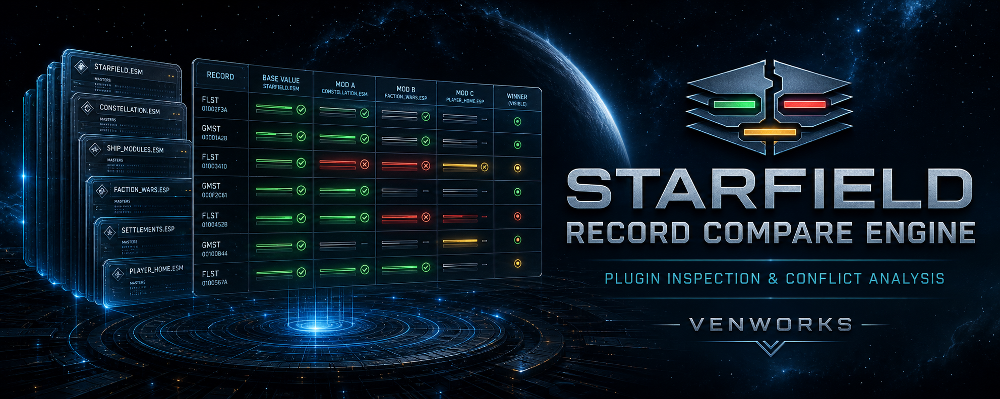
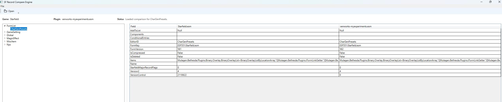

# Starfield Record Compare Engine

This application is a Mutagen-based plugin inspection and comparison tool. It combines a UI with a backend analysis
engine to load Bethesda plugin files, parse their record hierarchy, and present the results in an easy-to-navigate
format.

The tool focuses on helping mod authors and developers inspect plugin records, review overrides, browse records by
type, and compare matching records across plugins. It is intended to support debugging, validation, compatibility
review, and general plugin analysis workflows.

## Current Features

1. Discovers the local Starfield plugin load order
2. Imports plugin metadata, master references, and supported record details into a local SQLite cache
3. Browses records owned by a selected plugin in a filterable record tree
4. Filters records by FormID and EditorID
5. Compares matching records across imported plugins in load-order order
6. Highlights matching values in green, conflicts in red, and the visible winning override in yellow
7. Skips unchanged plugins during later imports for faster startup processing
8. Supports light and dark application themes

## Currently Supported Record Types

1. Form Lists (FLST)
2. Game Settings (GMST)
3. Globals (GLOB)
4. Miscellaneous Items (MISC)
5. Keywords (KYWD)
6. NPCs (NPC_)
7. Actor Value Information (AVIF)
8. Magic Effects (MGEF)
9. Perks (PERK)

## Planned Roadmap

1. Support the remaining Starfield record types
2. Add Spriggit-compatible plugin and record export/import
3. Validate supported record types against Spriggit and xEdit
4. Add record editing, plugin saving, plugin creation, and patch creation workflows

Long-term goals include local LLM-assisted patch creation and support for other Bethesda games.

## Current Limitations

1. Only a subset of Starfield record types are currently supported.
2. Complex nested child structures for supported records are deferred until they can be represented with normalized
   typed fields or child tables.
3. `BlueprintShips*.esm` plugins are intentionally skipped during import.

## Required Development Environment

1. Must have Starfield installed on your system
2. Must have Visual Studio 2022 or later, VS Code, or JetBrains Rider (Preferred)
3. Must have .NET 10 SDK installed

## Social Presence

1. I can be found as Venpi hanging out in the Quarter Onion Games Discord server.
2. You can follow me on X as [@monstercookiebd](https://x.com/monstercookiebd).
3. You can follow me on Threads as [@monstercookiebd](https://www.threads.net/@monstercookiebd).
